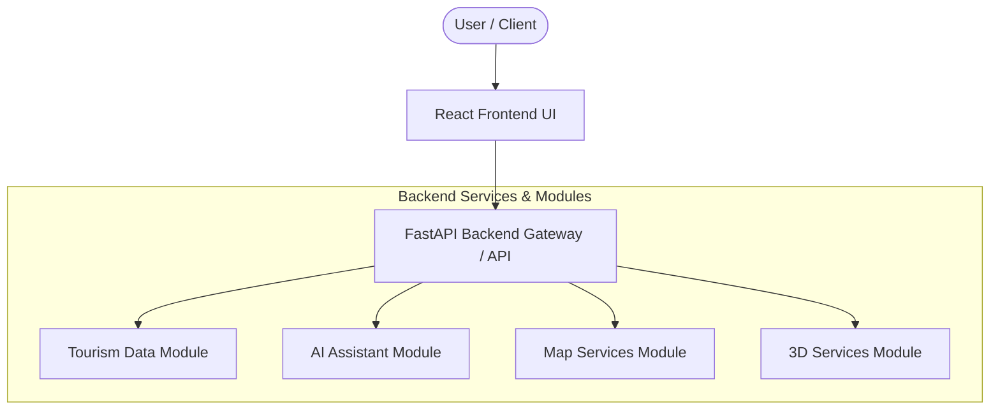

# CodeNova-SIH-2026 System Architecture

## Overview
CodeNova is an intelligent tourism exploration platform designed for the Smart India Hackathon (SIH) 2026. The platform connects travelers with comprehensive tourism insights, interactive maps, AI-driven guidance, and immersive 3D experiences.

---

## Planned Architecture

```
User
 │
 ▼
React Frontend
 │
 ▼
FastAPI Backend
 ├── Tourism Data
 ├── AI Assistant
 ├── Map Services
 └── 3D Services
```



---

## Architecture Breakdown

### 1. Client Layer (React Frontend)
- **Technology**: React (SPA / Modern UI)
- **Role**:
  - Interactive web interface for exploration, itinerary planning, search, and map interaction.
  - Responsive visual presentation across mobile and desktop devices.
  - Consumes RESTful APIs from the FastAPI backend.

### 2. Application Layer (FastAPI Backend)
- **Technology**: FastAPI (Python)
- **Role**:
  - High-performance, asynchronous API gateway and service router.
  - Request validation, serialization, security, and error handling.
  - Orchestrates communication between client requests and underlying service modules.

### 3. Backend Core Service Modules
- **Tourism Data Module**:
  - Manages structured information for Indian states, destinations, heritage sites, cultural points of interest, and regional categories.
  - Provides querying, filtering, and full-text search capabilities.
- **AI Assistant Module**:
  - Powers interactive conversational guidance, travel recommendations, queries, and contextual itinerary support.
- **Map Services Module**:
  - Handles geospatial data, state/regional boundaries, location coordinates, routes, and interactive map layers.
- **3D Services Module**:
  - Supplies metadata, asset coordinates, and spatial configurations for virtual 3D models, monument tours, and navigation.

---

## Data Flow & Communication
1. **User Interaction**: The user performs actions (e.g., search, filter by state, chat with AI, view 3D landmarks) via the React UI.
2. **API Request**: The React frontend sends HTTP/REST requests (e.g., `GET /api/places`, `POST /api/ai/chat`) to FastAPI.
3. **Service Dispatch**: FastAPI validates the incoming payload and routes the call to the relevant module.
4. **Response Assembly**: The module processes the logic, queries datasets or AI models, and returns structured JSON responses to the frontend.
