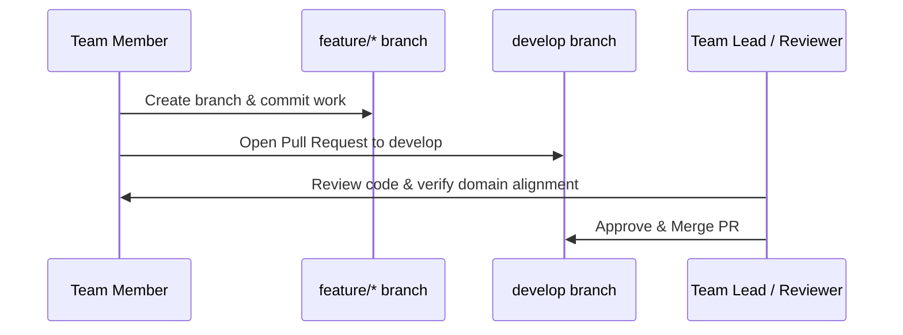

# CodeNova-SIH-2026 Development & Collaboration Guide

Welcome to the **CodeNova-SIH-2026** development guide. This document outlines the Git branching model, domain assignments, and contribution guidelines for team members.

---

## 1. Branch Strategy

We follow a structured Git branching model to ensure code stability and seamless collaboration.

```
main (Production / Stable)
  ▲
  │ (Release PRs)
develop (Integration / Staging)
  ▲
  │ (Feature PRs)
feature/<domain-or-feature-name> (Individual Member Branches)
```

### Branch Definitions
- **`main`**: The **stable branch**. Holds production-ready, demoable code. Direct commits and force pushes to `main` are strictly prohibited.
- **`develop`**: The **integration branch**. All completed feature branches are merged here first for integration testing and system-level validation.
- **`feature/*`**: **Individual member branches**. Created from `develop` for specific domain tasks or features (e.g., `feature/frontend-map-view`, `feature/ai-chat-service`).

---

## 2. Domain Ownership & Separation of Concerns

To minimize merge conflicts and maximize velocity during the hackathon, **each member works only in their assigned domain**:

1. **System Architecture + Integration**: Repository structure, API contracts, orchestration, deployment, and end-to-end integration.
2. **Frontend/UI**: React application, design system, layouts, navigation, and user experience.
3. **Interactive India Map + Location**: Map integration, geospatial rendering, regional/state layers, and pinpoints.
4. **AI Tourism Assistant**: Conversational agent, prompt templates, tourism recommendation logic, and LLM integrations.
5. **3D + Navigation**: 3D monument models, interactive spatial views, rendering pipelines, and virtual tours.
6. **Tourism Research + Content**: Structured datasets for Indian states, verified tourism facts, images, metadata, and schemas.

---

## 3. Pull Request (PR) Workflow

All code contributions must go through Pull Requests.



### Step-by-Step Workflow:
1. **Pull Latest Changes**:
   ```bash
   git checkout develop
   git pull origin develop
   ```
2. **Create a Feature Branch**:
   ```bash
   git checkout -b feature/<your-domain-feature>
   ```
   *Example*: `feature/tourism-data-states`
3. **Commit Within Your Domain**:
   - Write clean, modular code.
   - Keep commits atomic with descriptive commit messages.
4. **Push Branch & Open PR**:
   - Push your branch to the remote repository.
   - Open a Pull Request targeting the **`develop`** branch.
   - Fill out the PR description with:
     - Domain area
     - What was added or modified
     - Verification / testing steps performed
5. **Review & Merge**:
   - At least one review is required before merging into `develop`.
   - Once validated, the feature is merged into `develop`.
   - Periodic releases are merged from `develop` into `main`.

---

## 4. Development Rules
- **Respect Domain Boundaries**: Do not edit files outside your assigned domain without prior coordination with the domain owner.
- **No Direct Commits to `main` or `develop`**: Always use feature branches.
- **Keep Contracts Intact**: Ensure any backend or frontend changes adhere strictly to [`docs/api-contract.md`](file:///c:/Users/sinha/OneDrive/Desktop/CodeNova-SIH-2026/docs/api-contract.md).
